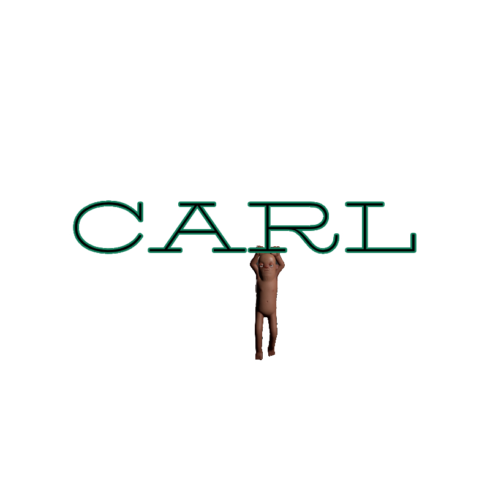

# CARL



CARL is the Citizen Animation Retargeting Library, an s&box editor library for retargeting FBX character animations onto a Citizen-based target model.

It adds a `CARL` editor menu with source scanning, orientation setup, bone mapping, retarget queueing, diagnostics, and target-side preview tools.

## Repository And Instructions

Original repository: [pumped-bit/citizen-animation-retargeting-library](https://github.com/pumped-bit/citizen-animation-retargeting-library).

Use this README for install, first setup, workflow, diagnostics, and support notes. Inside s&box, start with the `Diagnostics` tab after installing so CARL can verify Blender, Rokoko, bundled backend files, and the current target model.

## Requirements

- Windows.
- An s&box project.
- Blender installed. Blender 4.4 is the current known-good version.
- Rokoko Studio Live for Blender installed and enabled in the Blender version used by the tool.
- The standard s&box Citizen assets available to the project.

Blender and Rokoko are external dependencies. CARL does not install them, but the Diagnostics tab will tell you exactly what is missing.

## Install

Copy the library folder into your project:

```text
YourSboxProject/
  Libraries/
    CitizenRetarget/
      citizenretarget.sbproj
      Code/
      Editor/
      Assets/
      branding/
      tools/
      README.md
      CHANGELOG.md
      LICENSE
      THIRD_PARTY_NOTICES.md
```

Restart the s&box editor, or run `Compile local`.

Open the tool from:

```text
CARL -> Open Retargeter
```

When updating an existing install, delete the old `Libraries/CitizenRetarget` folder first, then copy the new folder. Do not merge old and new folders together.

## First Setup

Open `Diagnostics` first.

1. Press `Re-scan`.
2. Confirm setup is ready.
3. If Blender is missing, browse to `blender.exe`.
4. If Rokoko is missing, press `Auto Scan` or browse to the Rokoko addon folder / `__init__.py`.
5. If the native FBX helper is missing, press `Download Helper`. CARL downloads the official GitHub Release asset, verifies SHA256, and installs `ual2_ufbx_helper.dll`.
6. Press `Re-scan` again.

Local tool settings are stored in:

```text
YourSboxProject/.sbox/citizen_retarget/settings.json
```

Most users should leave `Backend Override` empty. The bundled backend inside the library is used automatically.

## Basic Workflow

1. Open `Home`.
2. Select or create a target Citizen model.
3. Pick a source `.fbx` animation file.
4. Choose a source preset if needed. `Generic Humanoid` is the default, and `Mixamo Humanoid` is available for Mixamo-style rigs.
5. Press `Scan`.
6. If needed, open `Mapping` and adjust source orientation or bone mapping.
7. Select clips.
8. Press `Add To Retarget Queue`.
9. Press `Run Queue`.
10. Preview the generated target animation or open the target model in ModelDoc.

Generated animations appear in `Target Results`.

## Mapping And Orientation

Use `Mapping` when a source rig does not retarget correctly.

The usual fixes are:

- choose the right preset;
- rotate the source orientation guide until the source skeleton faces the Citizen reference direction;
- correct any obviously wrong bone assignments;
- save the mapping profile if you made manual changes.

Visual preview is the final check. Different FBX sources use different skeleton conventions, so a technically valid mapping can still need manual orientation adjustment.

## Diagnostics And Support

Use `Diagnostics` when setup, scanning, or retargeting fails.

The most useful actions are:

- `Copy Diagnostics`: copies setup status, Blender path/version, Rokoko status, latest run summary, and artifact paths.
- `Export Support Bundle`: writes a shareable support bundle with logs and diagnostics.
- `Download Helper`: installs the Windows native FBX helper from the verified GitHub Release asset when s&box package publishing did not include the DLL.
- `Open` buttons: open relevant backend, Blender, Rokoko, or artifact folders when available.

When asking for help, include the copied diagnostics text or the exported support bundle.

## Output Locations

Generated assets stay in the target project, not inside the library:

```text
Assets/models/citizen_custom/
Assets/models/citizen_custom/animations/
.tmp/citizen_retarget/
```

This means you can update or replace the library without deleting generated target animations.

## Known Limitations

- Windows is the supported release target.
- Blender and the Rokoko addon must be installed separately.
- Blender 4.4 is the known-good version. Newer Blender versions can work, but may need per-machine verification.
- Target-animation delete can require a manual UI refresh in some cases.
- Retarget quality depends on source rig quality, source orientation, and mapping correctness.

## License

CARL is released under the MIT License. Vendored third-party source notices are listed in `THIRD_PARTY_NOTICES.md`.

## Maintainers

Maintained by [pumped-bit](https://github.com/pumped-bit).

Development-only docs, scripts, examples, and release workflow notes live under `dev/`. They are not required for a normal library install.
